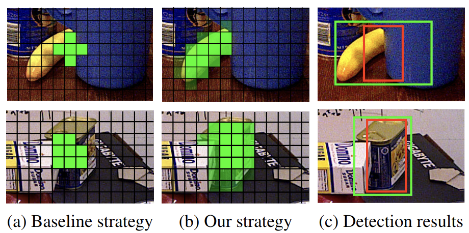
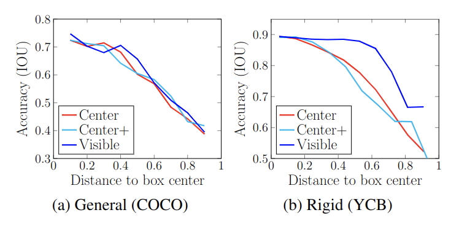

# RADet

**This** is the offical code for [''Rigidity-Aware Detection for 6D Object Pose Estimation''](https://arxiv.org/pdf/2303.12396.pdf) (CVPR 2023).

[Yang Hai](https://yanghai-1218.github.io), Rui Song, Jiaojiao Li, [Mathieu Salzmann](https://people.epfl.ch/mathieu.salzmann) and  [Yinlin Hu](https://yinlinhu.github.io).

**Update**: We have released the code for combining RADet with [WDR-Pose](https://arxiv.org/abs/2104.00337), which is a part of the Best Single-Model Solution for BOP Challenge 2022. Please check out [PseudoFlow](https://github.com/YangHai-1218/PseudoFlow)!

## Introduction

Most recent 6D object pose estimation methods first use object detection to obtain 2D bounding boxes before actually regressing the pose. However, the general object detection methods they use are ill-suited to handle cluttered scenes, thus producing poor initialization to the subsequent pose network.

<div align="center">
    
</div>
(a) The standard detection strategy chooses positive samples (green cells) around the object center, thus suffering from occlusions. (b) Instead, we propose to use a visibility-guided sampling strategy to discard the occluded regions and encourage the network to be supervised by all visible parts. The sampling probability is depicted by different shades of green. (c) Our method (green boxes) yields more accurate detections than the standard strategy (red boxes).

<div align="center">
    
</div>
Our motivation is from the rigidity property of targets in 6D object pose estimation. We show the testing accuracy of different sampling strategies w.r.t. different local predictions during training on the typical general object dataset (COCO) and on the typical 6D object pose dataset (YCB). We report the results of FCOSv2 (Center), ATSS (Center+), and a strategy exploiting all the candidates in the ground-truth mask (Visible). The horizontal axis represents the normalized distance of a local prediction to the box center. Although the accuracy of different strategies is similar on COCO, the visibility-guided sampling is much more accurate on YCB, even when the local predictions come from non-center areas, thanks to the rigidity of the target objects.

## Installation
This code has been tested on a `ubuntu 18.04` server with `CUDA 11.3`
- Install necessary python packages by `pip install -r requirements.txt`.
- Build other dependencies by `python setup.py develop`.

## Dataset Preparation

- Download [BOP datasets](https://bop.felk.cvut.cz/), and place them under the `data` directory.

- Collect image file lists for the desired data. 
  
  For example, collect the PBR images for YCB-V dataset:

```shell
python tools/collect_image_list.py --source-dir data/ycbv/train_pbr --save-path data/ycbv/detector_annotations/train_pbr.json --pattern */rgb/*.png
```

- Convert BOP annotations into COCO format.

```shell
python tools/bop_to_coco.py --images-dir data/ycbv/train_pbr --images-list data/ycbv/images_list/train_pbr.txt --save-path data/ycbv/detector_annotations/train_pbr.json --dataset ycbv
```

## Testing
Use `tools/test.py`:
```shell
python tools/test.py --config configs/bop/r50_ycbv_pbr.py --checkpoint checkpoints/radet_ycbv_pbr.pth --format-only --eval-options jsonfile_prefix=work_dirs/results/radet_ycbv_pbr
```

## Training

Use `tools/train.py`:

```shell
python tools/train.py --config configs/bop/r50_ycbv_pbr.py
```


## Pretrained models and detection results

We put the pretrained models and the corresponding detection results of 7 BOP core datasets at [here](https://drive.google.com/drive/folders/18_P693QoT9yTup1I8rmn7Jcs4DmQ2wOQ?usp=share_link). (We use a score threshold of 0.1 to filter out the false positives for the second-stage pose estimation in the paper.)

## Citation

If you find this project is helpful, please cite:

```
@inproceedings{yang2023radet,
  title={Rigidity-Aware Detection for 6D Object Pose Estimation},
  author={Yang Hai and Rui Song and Jiaojiao Li and Mathieu Salzmann and Yinlin Hu},
  booktitle={CVPR},
  year={2023}
}
```

## Acknowledgement

We build our framework based on [mmdetection](https://github.com/open-mmlab/mmdetection) and [MBS](https://github.com/YinlinHu/MBS). We thank the authors for their great code repositories.
